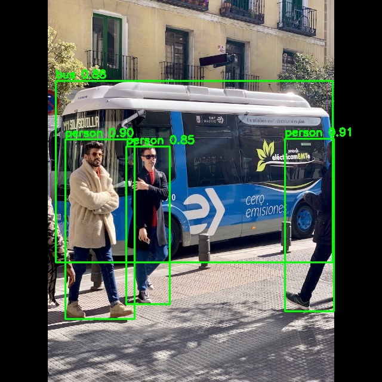
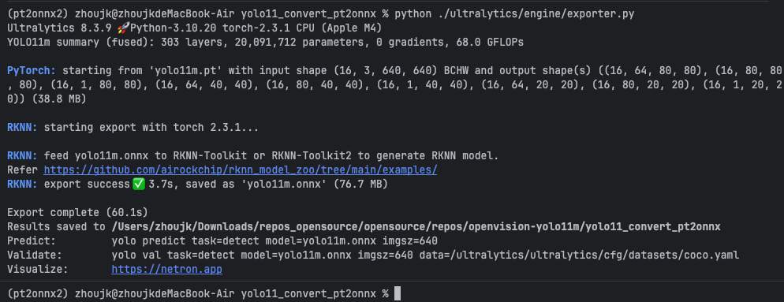
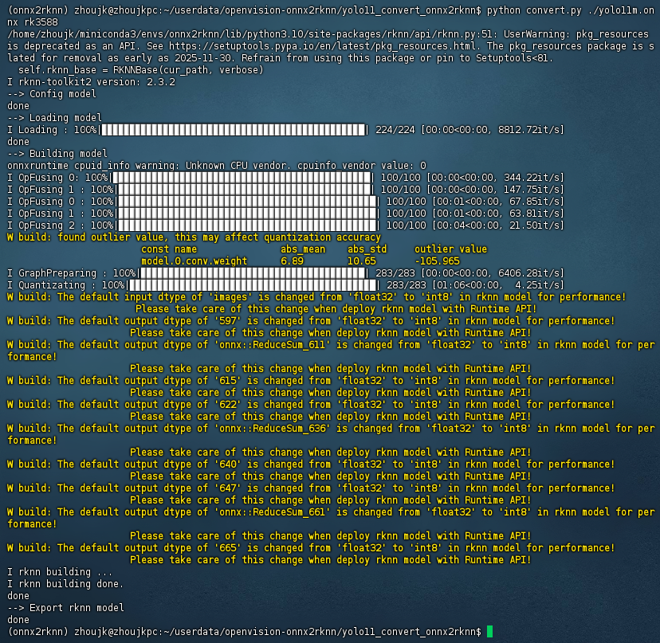
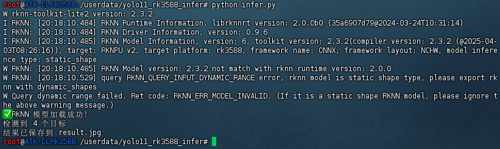

# rk3588部署yolo11m



​										图-推理结果

## 将yolo11从pt转换成onnx

### 引用

**参考这个教程和仓库**

- 链接：https://github.com/yuking926/RKNN-YOLO11
- 类型：github

### 位置

openvision/yolo11_convert_pt2onnx/

### 命令

下载本仓库，进入仓库文件夹，然后执行以下命令（在mac/windows/ubuntu中运行）

```shell
# 创建虚拟环境
conda create -n pt2onnx python=3.10
conda activate pt2onnx

# 安装依赖
cd yolo11_convert_pt2onnx
pip install -e .
pip install onnxscript
pip install torch==2.3.1 torchvision==0.18.1

# 下载pt模型
python download.py
# 或者
curl -L -o yolo11m.pt 'https://github.com/ultralytics/assets/releases/download/v8.3.0/yolo11m.pt'

# 转换成onnx
export PYTHONPATH=./
python ./ultralytics/engine/exporter.py
```



​											图-pt转换成onnx完成

## 将yolo11从onnx转换成rknn

### 引用

**参考这个教程和仓库**

- 链接：https://github.com/yuking926/RKNN-YOLO11
- 类型：github

### 位置

openvision/yolo11_convert_onnx2rknn/

### 命令

下载本仓库，进入仓库文件夹，然后执行以下命令（在ubuntu中运行）。

先将onnx模型拷贝到openvision/yolo11_convert_onnx2rknn/目录下。

```shell
# 进入文件夹
cd yolo11_convert_onnx2rknn

# 安装miniconda
wget https://repo.anaconda.com/miniconda/Miniconda3-latest-Linux-aarch64.sh -O miniconda.sh
bash miniconda.sh
~/miniconda3/bin/conda init bash
source ~/.bashrc
conda --version
conda info

# 创建虚拟环境
conda create -n onnx2rknn python=3.10
conda activate onnx2rknn
# 下载requirements.txt和whl这2个文件
# https://github.com/airockchip/rknn-toolkit2/tree/master/rknn-toolkit2/packages/arm64
curl -LO 'https://raw.githubusercontent.com/airockchip/rknn-toolkit2/master/rknn-toolkit2/packages/arm64/arm64_requirements_cp310.txt'
curl -LO 'https://github.com/airockchip/rknn-toolkit2/raw/master/rknn-toolkit2/packages/arm64/rknn_toolkit2-2.3.2-cp310-cp310-manylinux_2_17_aarch64.manylinux2014_aarch64.whl'

export PYTHONNOUSERSITE=1
python -m pip install --no-user -r arm64_requirements_cp310.txt
python -m pip install ./rknn_toolkit2-2.3.2-cp310-cp310-manylinux_2_17_aarch64.manylinux2014_aarch64.whl
python -m pip uninstall -y opencv-python
python -m pip install "opencv-python-headless>=4.5.5.64,<4.12"

# 转换成rknn
python convert.py ./yolo11m.onnx rk3588
```



​											图-onnx->rknn转换完成

## 将yolo11在rk3588板子推理

### 引用

**参考这个教程和仓库**

- 链接：https://github.com/yuking926/RKNN-YOLO11
- 类型：github

### 位置

openvision/yolo11_rk3588_infer/

### 命令

下载本仓库，进入仓库文件夹，然后执行以下命令（在rk3588中运行）。

先将rknn模型拷贝到openvision/yolo11_rk3588_infer/目录下。

```shell
# 进入文件夹
cd yolo11_rk3588_infer

# 安装conda
# 下载 Miniforge ARM64（电脑下载再传到板子）                                                    
wget https://github.com/conda-forge/miniforge/releases/latest/download/Miniforge3-Linux-aarch64.sh
# 安装
bash Miniforge3-Linux-aarch64.sh -b -p $HOME/miniforge
# 初始化
source ~/miniforge/etc/profile.d/conda.sh
conda init bash
source /root/.bashrc

# 安装依赖
conda create -n yolo11_infer python=3.10
conda activate yolo11_infer
# 下载 whl（电脑下载再传到板子）
# https://github.com/airockchip/rknn-toolkit2/blob/master/rknn-toolkit-lite2/packages/rknn_toolkit_lite2-2.3.2-cp310-cp310-manylinux_2_17_aarch64.manylinux2014_aarch64.whl
pip install rknn_toolkit_lite2-2.3.2-cp310-cp310-manylinux_2_17_aarch64.manylinux2014_aarch64.whl -i https://pypi.tuna.tsinghua.edu.cn/simple --trusted-host pypi.tuna.tsinghua.edu.cn

pip install "numpy>=1.21.0,<2.0.0" -i https://pypi.tuna.tsinghua.edu.cn/simple --trusted-host pypi.tuna.tsinghua.edu.cn

pip install "opencv-python-headless>=4.5.5.64,<4.12" -i https://pypi.tuna.tsinghua.edu.cn/simple --trusted-host pypi.tuna.tsinghua.edu.cn

# 执行推理
python infer.py
```




​											图-推理完成

---

# RK3588 系统烧录

详见：[rk3588_guide/README.md](./rk3588_guide/README.md)

