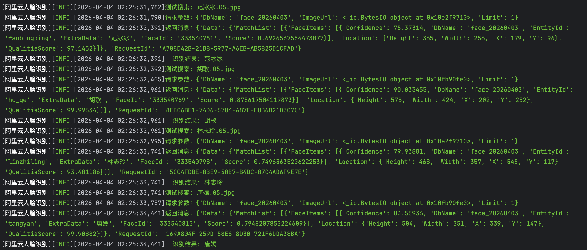

> 引用阿里云官方接口文档：https://help.aliyun.com/zh/viapi/use-cases/face-search-1-n

**想要往人脸数据库中添加图片：需要3个步骤**

- 1.创建人脸数据库；

- 2.往人脸数据库中添加人员（就是官方文档中的添加人脸样本）；

- 3.为每个人员添加人脸图片（就是官方文档中的添加人脸数据）。


**1.创建数据库**

认证信息：

```python
access_key_id = 'LTAxxxxxxxxxxxxxxxxxx'
access_key_secret = 'xxxxxxxxxxxxxxxxxxxxxxx'
endpoint = 'facebody.cn-shanghai.aliyuncs.com'
region_id = 'cn-shanghai'
```


**2.往人脸数据库中添加人员（就是官方文档中的添加人脸样本）**

参数：

```python
db_name = db_name # 数据库名称
entity_id = person_name # 人员名称（只能包含字母、下划线、数字）
```


**3.为每个人员添加人脸图片（就是官方文档中的添加人脸数据）**

参数：

```python
image_url_object = stream # 图片的字节流
db_name = db_name # 数据库名称
entity_id = name_en # 为每一个人员设定一个只包含[字母、下划线、数字]的唯一标识
extra_data = name_cn # 每个人员的中文名
```



图1-阿里云人脸客户端测试结果
